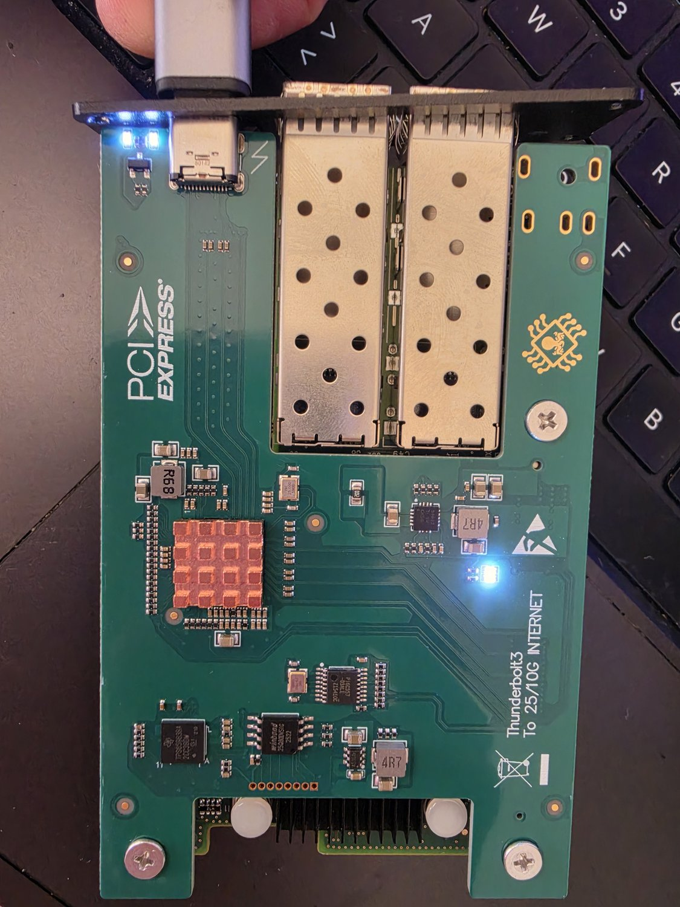
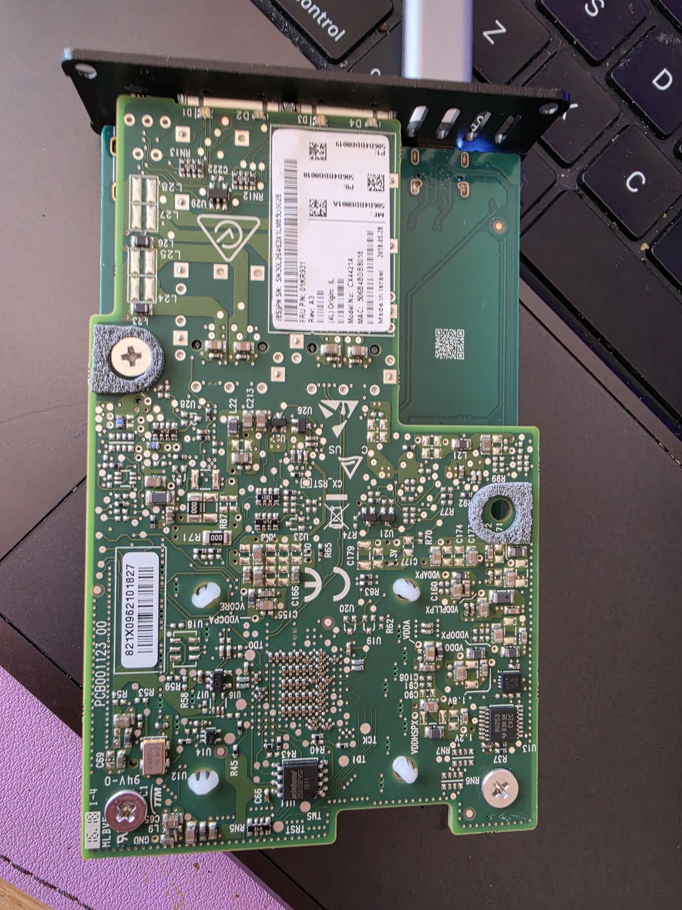

# Hardware note: the "Plyisty" Thunderbolt-to-25G adapter

A generic Thunderbolt 3 to dual-SFP28 25G adapter, sold on Amazon under the
name "Plyisty" (~221 EUR, Sep 2026). Bus-powered, no external supply, and
runs warm under the heatsink. Bought to give the Mac side of StrixLink a
25G-class alternative path alongside the direct Thunderbolt cable, and
because the card inside is RDMA-capable (see below).

## What's inside

A Thunderbolt 3 carrier board holds a Mellanox ConnectX-4 Lx OCP 2.0
mezzanine card, model **CX4421A** (MCX4421A class, dual 25G).

- **Photo**: silkscreen reads "Thunderbolt3 To 25/10G INTERNET"; the carrier
  exposes USB-C upstream, two SFP28 cages, and a Thunderbolt controller under
  a copper heatsink. Two LEDs are lit when the adapter is powered.
- **Thunderbolt enumeration (measured)**: vendor "PX", device "Thunderbolt
  To Ethernet", Thunderbolt 3 mode, 40 Gb/s.
- **Card label (photo)**: "Model No: CX4421A", "Made in Israel", MAC
  `50:6B:4B:DB:80:18`. That MAC matches the interface MAC macOS reports for
  the adapter, so the photographed unit and the measured one are the same
  card.
- **PCI IDs (measured on the MacBook)**: `15b3:1015`, subsystem `15b3:0021`,
  two functions (one per port).
- **PCIe link (measured)**: x4 at 8.0 GT/s — Gen3 x4, about 31.5 Gbit/s
  usable before overhead. That's enough for one 25G port at full rate; the
  second port shares whatever the link has left.

## macOS behavior

Measured 23 Sep 2026, MacBook Pro M5 Max, macOS 27.0 build 26A428.

- Apple's built-in DriverKit driver, `AppleEthernetMLX5`, binds the card with
  no install needed. Two interfaces appear ("Thunderbolt Ethernet Slot 0,
  Port 1/2", here `en13`/`en14`). The media list includes 25GBase-CR/KR,
  10GBase-CR1/KR, and 1000Base-KX.
- **Gotcha**: on macOS 27 the adapter stays completely dark — Thunderbolt
  reports "No device connected" — until it's approved in the "Allow
  accessory to connect" prompt, or under System Settings > Privacy &
  Security > Allow accessories to connect.

## Earlier observation on this laptop

An older TB3 10G adapter made a TB5 NVMe enclosure unmountable when both
were plugged in. With the Plyisty, the enclosure stayed mounted with both
devices attached at once (23 Sep); unplugging the enclosure, the Plyisty
then took over that Thunderbolt bus.

## Why it matters for StrixLink

ConnectX-4 Lx is an RDMA-capable RoCEv2 NIC. On macOS, the RDMA side is not
provided by Apple's driver. Two community projects target it, upstream and
not measured by us:

- [Ash Hart's MCDMA](https://github.com/ashhart/MCDMA) — ConnectX-4 Lx was
  accepted in source via [its PR #3](https://github.com/ashhart/MCDMA/pull/3),
  on macOS 27 26A428.
- MelonDMA — a DriverKit ConnectX driver.

See [MCDMA_INTEGRATION.md](../MCDMA_INTEGRATION.md) for the contract this
repo's Strix-side `rxe` endpoint expects from a Mac-side RDMA transport.

## Not yet measured

Link to a peer, iperf3 throughput, and RDMA are all outstanding. Planned
first link: SFP28 DAC to a DGX Spark ConnectX-7, through a QSFP28-to-SFP28
(QSA) adapter.
